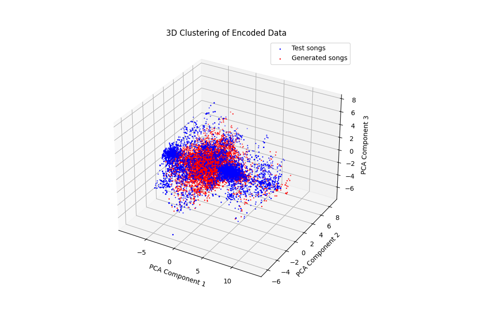

# GAN-music-generator-NNDL


<h2 align="center">
  
</h2>


An implementation of a Music generator through Generative Adversarial network, for the final project of the course Neural Networks and Deep Learning of the Master's Degree in Physics of Data at University of Padua. 

In this project, we explore the use of Convolutional Neural Networks (CNNs) within a Generative Adversarial Network (GAN) framework to generate sequences of MIDI notes one bar at a time.
The base model is inspired by the Yang et. al paper of 2017 "MidiNet: A Convolutional Generative Adversarial Network for Symbolic-domain Music Generation" (arXiv:1703.10847), but we propose the addition of a self-attention mechanism in the GAN architecture, which allows attention-driven, long-range dependency modeling of the song bars, enabling the model to capture more complexrelationships within the music.
We also propose two quantitative metrics for melody quality evaluation, one focused on the note frequency distribution, the other, more general, leverages embeddings from a pre-trained autoencoder. Through this set
of metrics we are able to evaluate the impact of self-attention layers in the training phase, showing an increase in similarity between real and generated data.    
We worked on a reduced version onf the LAKH dataset (https://colinraffel.com/projects/lmd).

<div align="center">
  
  <p><em>Latent space representation of the training song and the generated one, through PCA</em></p>
</div>


The repository contains:
- **Attention_MidiNet.ipynb** : the main jupyter notebook, with the full code implementation;
- Three python libraries we implemented, to be used in the main notebook: 

    - **preprocess_midi.py** : is the library containing all the functions needed for the preprocessing of MIDI files; 
    - **gan_model.py** : is the library containing everything about the GAN model, from the architecture, to the training and testing function, the functions to generate a new song and convert it into a MIDI file, and the pch metric functions.
    - **autoenc_model.py** : is the library containing the autoencoder model, and its training function, used to implement the clustering and reconstruction loss ("*autoencoder.pch*" is the state of the pretrained autoencoder to load for the autoencoder metric).
- The directories containing:
    -  a few samples from the (preprocessed) training midi files (*Melody from training set*)
    -  a few samples from the generated midi files without self-attention (*Sampled_songs_noattention*)
    -  a few samples from the generated midi files with self-attention (*Sampled songs*)
- The LateX report: "*Isotton_Munafo_Attention_Midinet.pdf"

Getting started
To get started, create an Anaconda environment called attention_midinet, clone repo and install the dipendency:

```bash
conda create -n attention_midinet python=3.8
conda activate attention_midinet
gh repo clone Sara-Munafo/GAN-music-generator-NNDL
pip install -r requirements.txt
```
then run the jupyter notebook.
